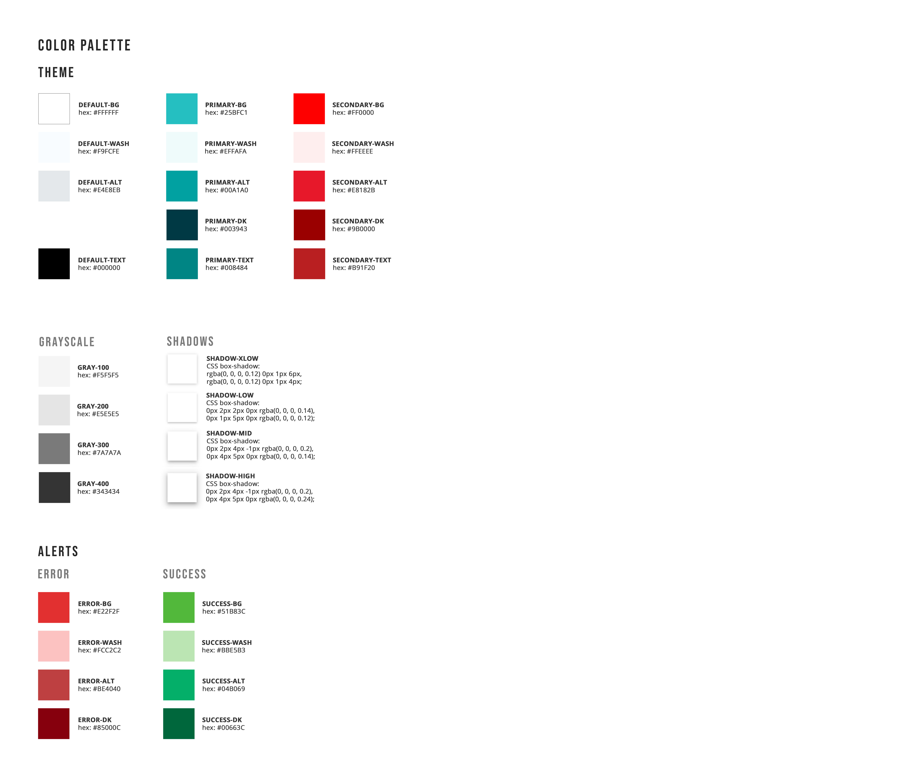
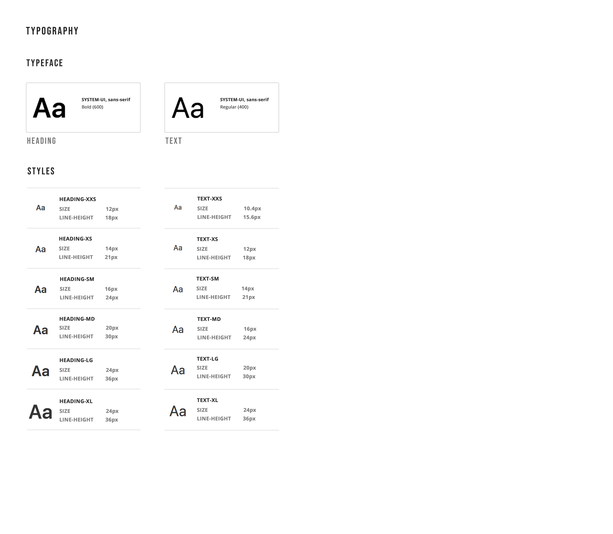
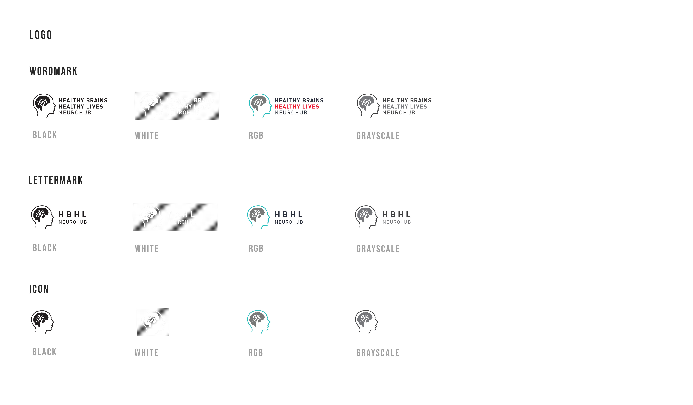
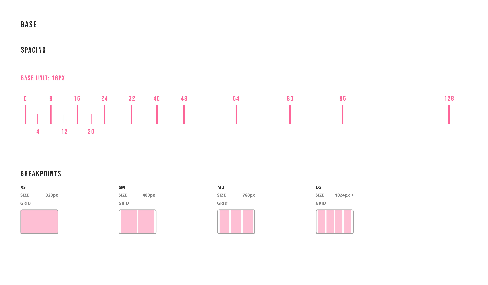
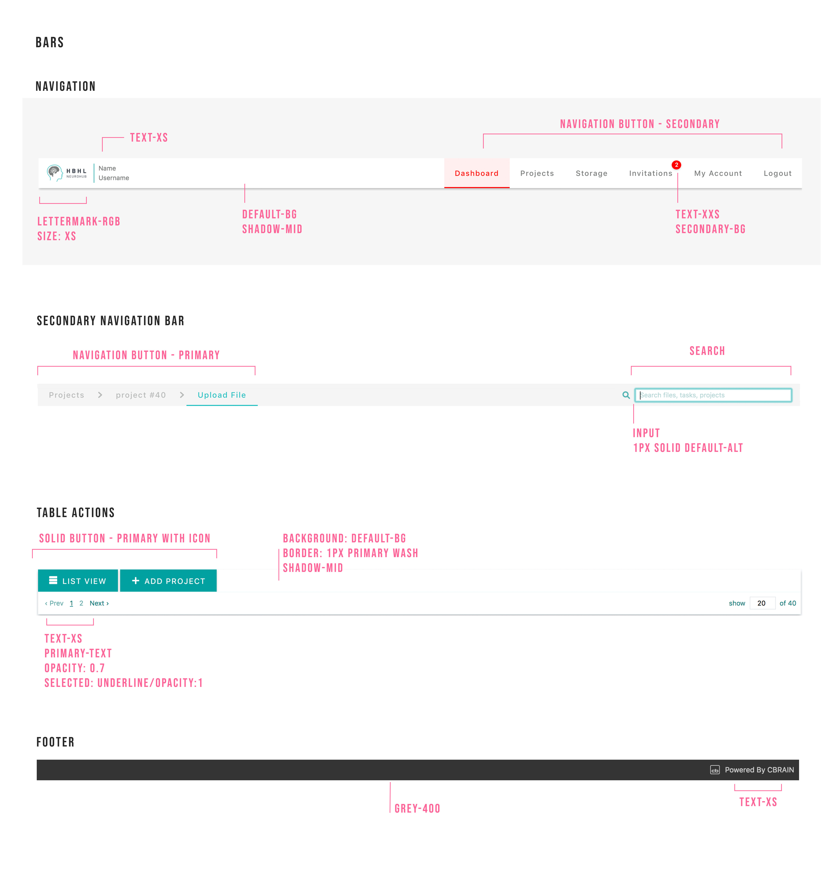
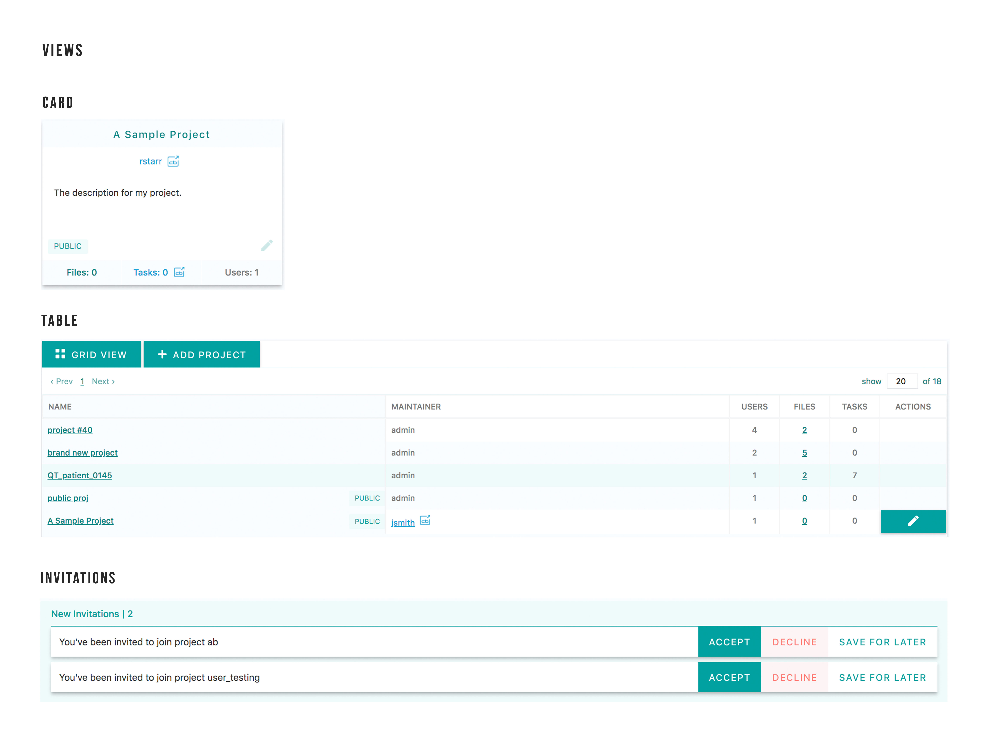

# Neurohub: Styleguide

The following contains the specifications for Neurohub.
You can view the styleguide live at: `/styleguide`.
Neurohub uses SCSS for styling, you can also learn more about how we use it here: [SCSS tutorial](https://github.com/aces/cbrain/BrainPortal/app/assets/stylesheets/SCSS_intro_tutorial.md)

