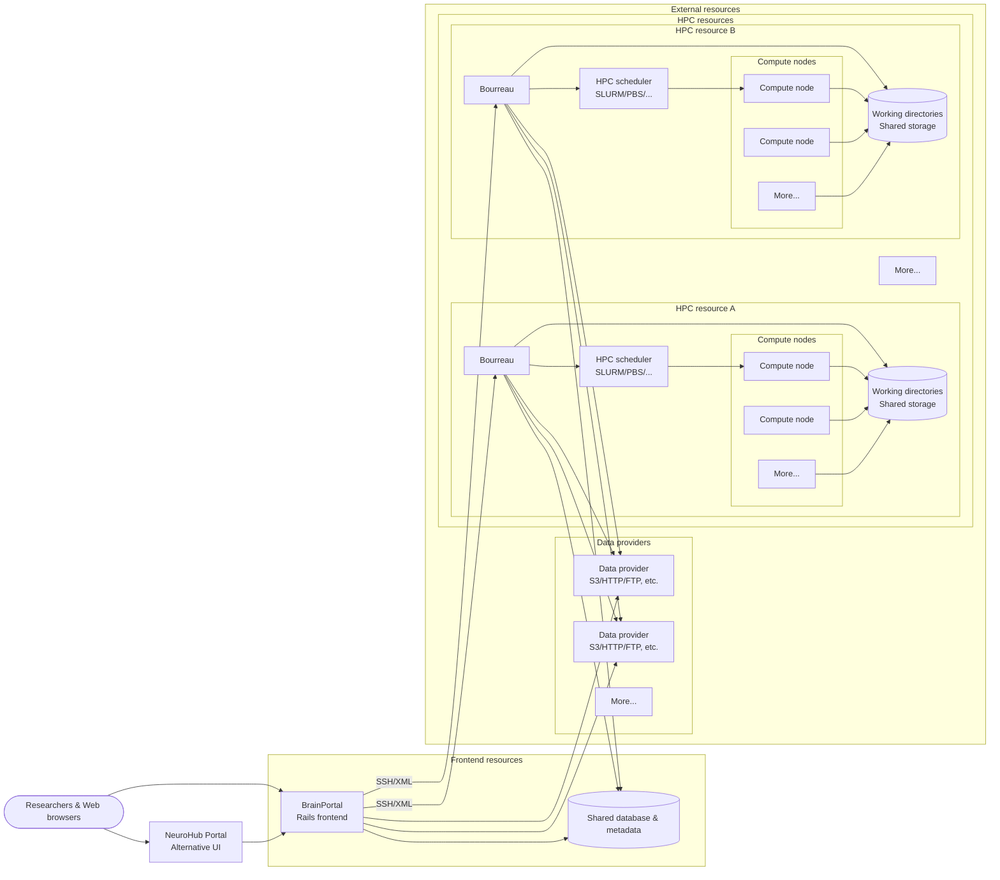

## CBRAIN

CBRAIN is a collaborative, web-enabled grid platform built to
facilitate research on large, distributed datasets by managing user
access, transfer, caching and provenence for distributed data, as
well as mediating interactions with high-performance computing
centres (HPCs).

## NeuroHub Portal

The NeuroHub Portal is an alternative interface to CBRAIN. It provides a few
special capabilities that are not accessible in CBRAIN, while also
lacking many of CBRAIN's features (because it is fairly new, as of
August 2020). Users can switch back and forth between the two
interfaces, since they share the same authentication and database
systems.

CBRAIN (and the alternative NeuroHub interface) consists of two Ruby on Rails Applications: BrainPortal and Bourreau

## System architecture

At a high level, researchers interact with BrainPortal (or the NeuroHub
portal) through a web browser. The arrows in the diagram show the primary
request flow; responses are implied by each call. BrainPortal orchestrates
access to data providers, persists metadata in the shared database, and
delegates execution requests to one or more Bourreau instances, typically
over SSH/XML. Each Bourreau runs on a specific HPC resource and connects
to the local scheduler to launch jobs on that resource's compute
nodes. Bourreaux manage working directories on shared storage, synchronize
job and file state back to the database for BrainPortal to display, and
fetch or stage data from multiple data providers as part of backend task
execution.

## BrainPortal

BrainPortal is the frontend of the CBRAIN architecture. It is a
Rails application that provides a web-based graphical user interface
to CBRAIN. Users can upload, tag and search their files. They can
launch compute-intensive processing jobs on remote High-Performance
Computing (HPC) sites. Remote file repositories can be created to
provide files from any network-enabled system.

## Bourreau

Bourreau is the backend of the CBRAIN architecture. It is a Rails
application that is not meant to serve the user directly. It interacts
with the CBRAIN Brainportal application using XML, acting as an
intermediary between user requests through BrainPortal and the
cluster management software running on High-Performance Computing
sites. A Bourreau receives requests to launch a processing task,
sets up the required working directories, runs the process and then
sends information about any newly created files back to BrainPortal.
A Bourreau can also be queried about the jobs that are currently
running on the HPC where it resides.

## For more information

CBRAIN is extensively documented in its [Wiki](https://github.com/aces/cbrain/wiki).
