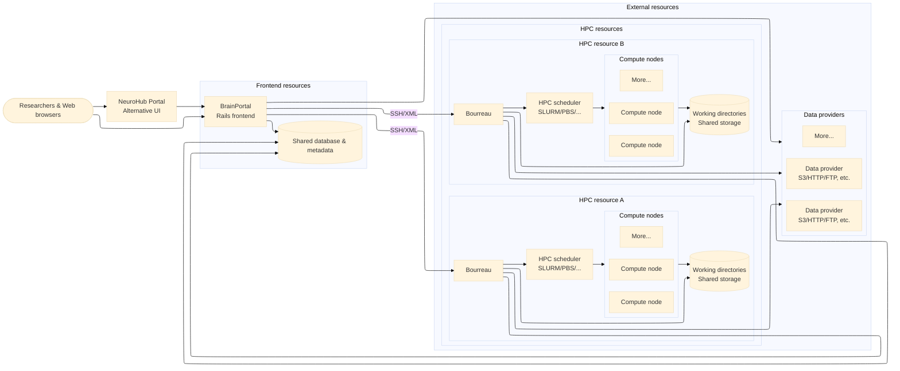

# System architecture

At a high level, researchers interact with BrainPortal (or the NeuroHub
portal) through a web browser. The arrows in the diagram show the primary
request flow; responses are implied by each call. BrainPortal orchestrates
access to data providers, persists metadata in the shared database, and
delegates execution requests to one or more Bourreau instances, typically
over SSH/XML. Each Bourreau runs on a specific HPC resource and connects
to the local scheduler to launch jobs on that resource's compute
nodes. Bourreaux manage working directories on shared storage, synchronize
job and file state back to the database for BrainPortal to display, and
fetch or stage data from multiple data providers as part of backend task
execution.
