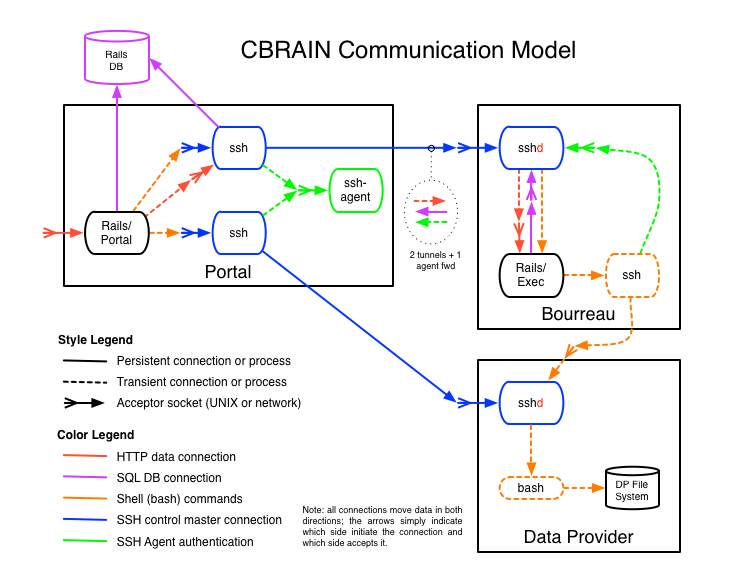

This page describes the different communication channels and protocols
that connects the main components of a typical CBRAIN installation.

Please refer to this diagram while reading the descriptions below it.

#### Components

There are three types of components shown in this picture: a
__Portal__ is a Rails application, a __Bourreau__ (a.k.a Execution
Server) is another Rails application, and a __Data Provider__ is an
abstract storage area. Each component is here located on a separate
host (the black boxes), but the discussion also applies when they
are combined. There are a few more notes to say about these components:

 1. The __Portal__ is unique within a CBRAIN installation, although
 as is common for Rails applications, several instances of the Rails
 application can be running.

 2. There can be several __Bourreaux__ within a CBRAIN installation;
 however, each one only runs a single instance of its Rails
 application.

 3. There can be several __Data Providers__ within a CBRAIN installation.
 Some of them do not require network connections to be operation,
 it depends on their _types_. Here we will only consider
 Data Providers that implement their data transfers through SSH
 network connections.

#### Types of communication channels

Some communication channels are persistently opened, and some
are created on demand. These can be distinguished by the use of
solid or dashed lines.

The types of communications vary greatly: there are XML messages
exchanged over HTTP, SQL databases connections, non interactive
bash commands over SSH, and SSH Agent requests.

#### Description of each channel

* A Portal's Rails application communicate with a SQL DB Server
using a standard MySQL network connection. This is represented by
the purple line connecting the Portal's Rails application with the
Rails DB.

* A Portal's Rails application starts a persistent "ssh-agent"
process to store and supply a SSH key for itself and other applications
within the CBRAIN application. This is represented by the light
green box in the Portal side.

* A Portal's Rails application maintain a persistent SSH network
connection to the host where a Bourreau is running. This is the
solid blue horizontal line connecting a "ssh" process of the Portal's
host to the "sshd" process of the Bourreau host. This SSH connection
can be used to carry four types of communications:

  1. Bash commands are sent by the Portal to launch or stop the
  Bourreau Rails application itself. This is represented by the
  dashed orange arrows on each side, going to "ssh" and emanating
  from "sshd".

  2. The Bourreau Rails application accesses its MySQL DB server
  using a local network address, which is tunneled by the local
  "sshd" back to the database server on the Portal side. This is
  represented by the solid purple arrows connecting the Bourreau's
  Rails application, back through the persistent SSH connection,
  and emanating from the "ssh" process on the Portal side.

  3. XML messages are sent by the Portal through a SSH tunnel and
  received by the Bourreau Rails application over HTTP. These are
  represented by the dashed red arrows.

  4. Whenever the Bourreau's Rails application need to initiate
  network connection of its own (for instance, when contacting a
  Data Provider, as shown later in this document), it will spawn a
  "ssh" process which will require a key. The key will be provided
  by the SSH Agent forwarding mechanism of the main SSH connection.
  This is represented by all the dashed light green arrows.

* When a Rails application (Portal or Bourreau) need to connect to
a networked Data Provider, a standard SSH connection is established.

  1. When the connection is initiated from the Portal, the connection
  is made persistent and re-used over time. This is represented by
  the long diagonal solid blue arrow between the Portal and the
  Data Provider.

  2. When the connection is initiated by a Bourreau, the connection
  is closed after each use. These is represented by the dashed
  orange connection between the Bourreau and the Data Provider.

  In both cases, the connection is used to launch bash commands
  (such as "rsync", or "rm -rf" etc). Also, in both cases, the "ssh"
  command that initiated the connection will authenticate by
  contacting the SSH Agent.  On the Portal side, the SSH Agent
  process is local, so the "ssh" command contacts it directly using
  its UNIX-Domain socket. On the Bourreau side, as explained above,
  the "ssh" command will contact a UNIX-Domain socket created by
  the "sshd" of the persistent control connection, which will forward
  the authentication to the SSH Agent running on the Portal.

#### SSH Agent Locking

As an added security measure, the SSH Agent is periodically locked
for the entire CBRAIN installation (including the Portal and all
Bourreaux) one minute after it was last accessed. This is performed
by a separate "Agent Locker" process, not shown in the diagram.
Whenever a Rails application need access to the CBRAIN key, it needs
to unlock it. The Rails code contain a method that is invoked before
each SSH operation is performed, which will fetch the locking
password from the database, unlock the SSH Agent, and notify the
Agent Locker process that the SSH Agent was unlocked. This notification
is performed by adding a row to a database table which is monitored
regularly by the the Agent Locker.

(Original author: Pierre Rioux)

