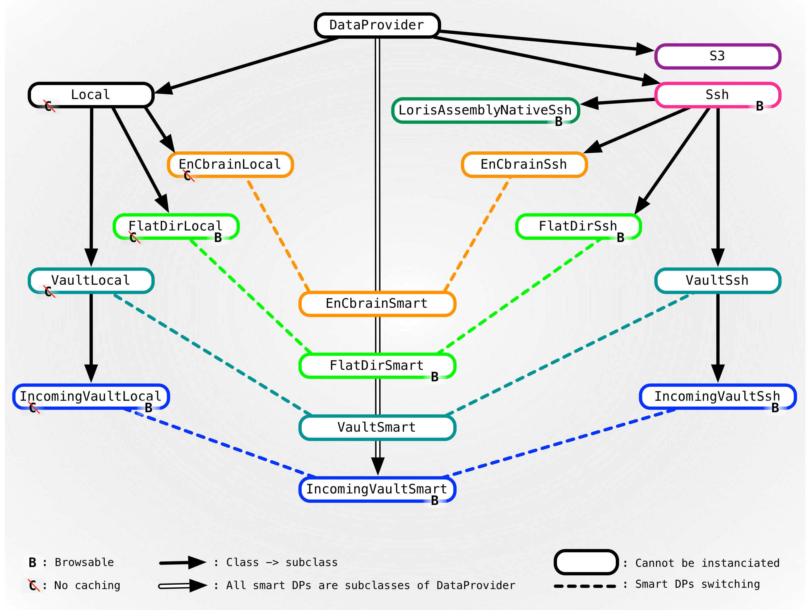

A Data Provider is a data storage area on CBRAIN. This section
describes Data Providers and how to create them. CBRAIN supports
different types of Data Providers, for example `SshDataProvider`
and `VaultSshDataProvider`; they differ in how they structure their
files on their respective storage areas.

## How to create a Data Provider

* Go to the "Data Providers" tab.
* Open the "Create new Data Provider" panel.
* Fill in the form:
  * **Name**: Name of the Data Provider.
  * **Description**: First line should be a short description, which
    will be used in the Data Provider table. After that you can add
    any special notes for the users.
  * **Time Zone**: The time zone of the Data Provider
  * **Type**: Type of Data Provider - (see below for more
  information).
  * **Owner**: The owner of the Data Provider.
  * **Project**: You can limit the access to a Data Provider to
    members of a specific project. For more information see the [Projects](admin_Projects.html) page.
  * **Status**: The Data Provider can be "online" or "offline".
    When "offline", the Data Provider will not be made available
    to users.
  * **Mode**: A Data Provider can be "read/write" or "read only".
    If it is "read/write" users with access to it can write on it,
    but if it is "read only" the users with access to it can just
    read the data stored on it.
  * **Syncability**: Robust synchronization and caching mechanisms
    were built into the core platform to avoid unnecessary data
    transfers. The portal and execution servers maintain a local cache
    of the files that have been asynchronously transferred to them.
    Synchronization status for all data in all caches is maintained
    in the metadata database by CBRAIN. Resources will use cached
    versions of files until the version on the Data Provider changes,
    at which point all cached versions will be flagged as invalid.
    Resources caching invalid data will simply resynchronize with the
    Data Provider upon the next requested data operation. Users can
    manually trigger cache deletion of their data if desired. A Data
    Provider can be "Fully syncable" in this case the synchronization
    mechanisms of CBRAIN are used or "Not syncable".
  * **SSH parameters for remote Data Providers**: Fill in this part
    if you configure a SshDataProvider with the **Remote Hostname**,
    the **Remote Username** and finally a **Remote Port Number** if
    necessary.
  * **Cloud Storage Configuration**: Fill in this part if you
    configure cloud storage, such as Amazon S3. In this
    case you should specify your **Client Identifier** and **Client Token**.
**Note**: Cloud storage is in the prototyping stage in CBRAIN. It
  is implemented as a proof of concept, but performance and reliability is not guaranteed.
  * **Physical data location**: With the "Full Directory Path" this field is not used for cloud storage.
  * **Other properties**:
    * Files must be copied/moved upon registration, only for browsable Data
    Providers.
    * Files will always be erased upon de-registration, only for browsable Data
    Providers.
    * Files can be browsed only by members of this project, only for browsable
    Data Providers.
    * Cannot be used for uploading files in the file manager.
    * Files cannot be viewed in the file manager, in this case no
      viewer will be available for files on this data provider.
* The **Public SSH Key for this CBRAIN Portal** for the CBRAIN installation
  is shown in a box, and this need to be installed on the remote host
  for SSH-based DataProviders (or Smart ones with a SSH personality).

## Types of Data Providers

This section describes different types of Data Providers implemented
in CBRAIN. Not all of them are useful. In production environments,
the recommended types are EnCbrainSmartDataProvider for official
data storage and SshDataProvider for user-specific personal storage.

#### LocalDataProvider
This is an abstract class which represents Data Providers where the
remote files are local to the currently running rails application.
Here, subclasses are not meant to cache anything! The 'remote' files
are in fact all local, and accessing the 'cached' files means
accessing the real provider's files. All methods are adjusted so
that their behavior is sensible.

#### FlatDirSshDataProvider (a.k.a. SshDataProvider)
This class provides an implementation for a Data Provider where the
remote files are accessed through ssh and rsync. The provider's
files are stored in a flat directory, one level deep, directly
specified by the object's remote_dir attribute. The file "hello"
is thus stored in a path like this: `/remote_dir/hello`.

#### VaultSshDataProvider
This class provides an implementation for a Data Provider where the
remote files are accessed through ssh and rsync. The provider's
files are stored in a flat directory, two levels deep, directly
specified by the object's remote_dir attribute and the user's login
name. The file "hello" of user "myuser" is thus stored in a path
like this: `/remote_dir/myuser/hello`.

#### VaultLocalDataProvider
This class provides an implementation for a Data Provider where the
remote files are local to the currently running rails application.
The provider's files are stored in a flat directory, two levels
deep, directly specified by the object's remote_dir attribute and
the user's login name. The file "hello" of user "myuser" is thus
stored into a path like this: `/root_dir/myuser/hello`, where
root_dir is the data provider's remote_dir (a local directory).
This Data Provider does not cache anything! The 'remote' files are
in fact all local, and accessing the 'cached' files mean accessing
the real provider's files. All methods are adjusted so that their
behavior is sensible.

#### VaultSmartDataProvider
This class implements a 'wrapper' Data Provider that acts either
as a VaultLocalDataProvider or a VaultSshDataProvider depending on
whether or not the current hostname matches the value of the attribute
remote_host. This means that in the case where the current Rails
application runs on the same machine as the Data Provider, the
faster and more efficient VaultLocalDataProvider will be used.

#### IncomingVaultSshDataProvider
This class behaves like the VaultSshDataProvider, except that it
is browsable. When browsing, only the subdirectory named like the
login name of the current user will be visible. It is perfect for
accessing a jailed remote_dir for incoming content, where users can
upload files to these subdirectories on other channels.

#### IncomingVaultLocalDataProvider
This class is exactly like VaultSshDataProvider, but it also has
the ability to browse a subdirectory named after a user when calling
provider_list_all(user).

#### IncomingVaultSmartDataProvider
This class implements a 'wrapper' data provider that acts either
as a IncomingVaultLocalDataProvider or a IncomingVaultSshDataProvider
depending on whether or not the current hostname matches the value
of the attribute remote_host. This means that in the case where the
current Rails application runs on the same machine as the data
provider, the faster and more efficient VaultLocalDataProvider will
be used.

#### EnCbrain*DataProvider
This class includes EnCbrainSshDataProvider, EnCbrainLocalDataProvider,
and EnCbrainSmartDataProvider. These three providers are enhanced
variations of each other that differ in how they transport data.
How they store their files is based on the IDs of those files. The path to
a file is uniquely determined by the file's ID. A file named "hello" with ID 41233
will be stored like this: `/root_dir/04/12/33/hello`. Such Data
Providers have the advantage that files can be renamed and reassigned
to new owners with minimal modifications on the filesystem's
structure. The EnCbrain\*DataProviders are the officially recommended
data providers for production deployment.

#### S3DataProvider
This class connects to Amazon's S3 cloud storage service. The files
will be stored in a bucket named `gbrain_{name}` where name is the
name of the Data Provider. Usage of this Data Provider requires
obtaining an access key and secret token. Do not rename this Data
Provider if files are registered with it, unless you also rename
the bucket!

## Reports

On the Data Providers index page you can find links to different
reports: the "User Access Report", the "Transfer Restrictions Report"
and the "Automatic Tabular Report Maker". You should consult the
[Reports And Monitoring](admin_Reports-And-Monitoring.html) section of this guide for more information
about the reports.

**Note**: Original author of this document is Natacha Beck.

