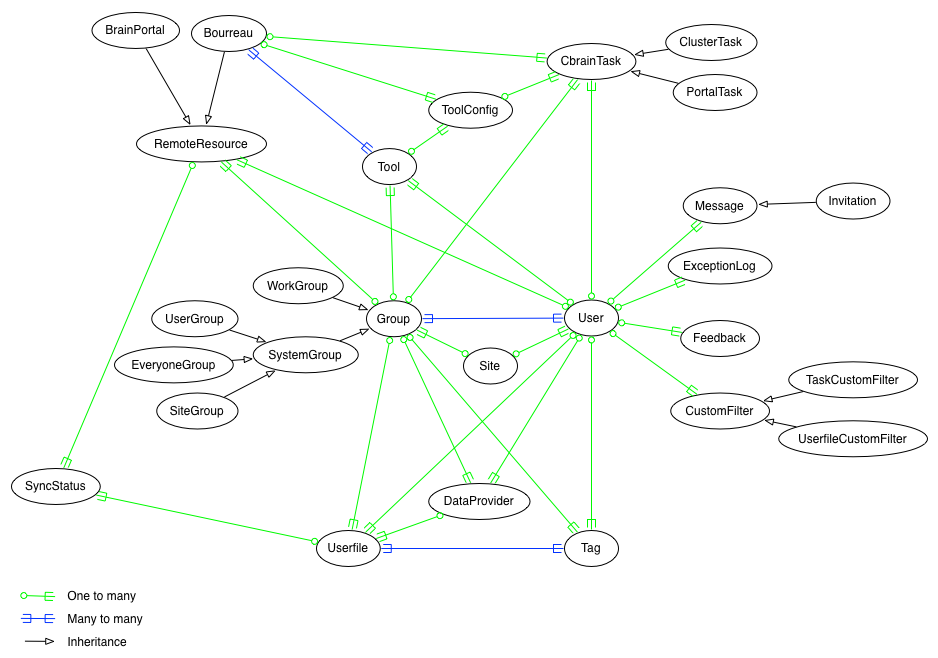

This page is the top level of the many programming guides
for the CBRAIN platform. Here you will find general information
about setting up a work environment, and information on how 
you can contribute to CBRAIN.

Here is a simplified diagram of the main ActiveRecord models of CBRAIN:

**Note**: Some models of CBRAIN are not represented in this simplified diagram.
This is the case for:
* All subclasses of DataProviders (VaultSmartDataProvider, SshDataProvider, LocalDataProvider, etc.)
* All subclasses of Users (AdminUser, SiteManager, NormalUser)
* Some isolated subclasses (ActiveRecordLog, MetaDataStore, SanityCheck)

A complete diagram can be generated using [RailRoady](https://github.com/preston/railroady).

## Setting up a development environment

* First, use a Mac or a Linux workstation for software development. 
  Create an empty directory where you will install the CBRAIN code base, 
  and follow the instructions in the [Setup Guide](../1-setup/Setup-Guide.html). In there you will 
  find a section with more specific instructions about getting your 
  personal CBRAIN system operational (including a local Execution Server).

* Second, become familiar with Ruby, and Ruby On Rails.  There are
  many good books and online resources to explain to you the
  basics of MVC (Model View Controller) programming, and they will
  also explain to you the role and typical location of all files in
  the code tree.

  CBRAIN uses the "Rails 3.2-Stable" branch of Rails running under
  Ruby 2.0 or better. A newer version of Rails is available (Rails 4), 
  but the codebase needs extensive modifications to get it running 
  under that version, and this will only happen in a future
  release.

* Third, create the code documentation. Once you have installed
  the code base, a bash script at the top level called "alldoc.sh"
  will do this for you. It invokes the 'rdoc' utility
  ([http://rdoc.sourceforge.net/doc/index.html](http://rdoc.sourceforge.net/doc/index.html))
  and will create a bunch of local HTML files that you can then access
  with your local browser. This is the ultimate source of documentation
  for the APIs!

## List of subguides

#### Style

The [Programming Style](Programming-Style.html) guide will get you acquainted with
the conventions we use for contributing code to CBRAIN.

#### Userfiles and CbrainTasks

If you are not planning to develop on the platform itself, but
simply want to contribute by creating new CbrainTasks or
Userfiles (which are deployed as [plugins](Plugins-Structure.html),
there are separate guides to help you learn about these, the
[CbrainTask Programmer Guide](cbrain-task/CbrainTask-Programmer-Guide.html) and the [Userfile Programmer Guide](userfile/todo_Userfile-Programmer-Guide).

#### Logging and provenance

Of common interest to all programmers are the CBRAIN libraries
that provide detailed logging for all ActiveRecord objects,
including facilities for recording GIT commit numbers of the
code that is being run. This is how data provenance and tracking
of modifications is performed within CBRAIN, linking data files
to tasks, etc. The APIs are described in [Logging And Provenance](todo_Logging-And-Provenance.html).

#### MetaData

CBRAIN provides a generic way to associate arbitrary key-value
pairs to any ActiveRecord objects. This API is described in the
[MetaData](todo_MetaData.html) manual.

#### External APIs

For programmers who want to use an external application or script instead
of a browser to interact with a CBRAIN platform, it is possible to do so
with an API.  In fact, THREE external APIs are available: one in 
Ruby, one in Perl, and one in Javascript. Consult the [External APIs](todo_External-APIs.html) manual 
for information about these APIs.

#### Testing suite

CBRAIN comes with a testing suite. Not all of the capabilities of
CBRAIN are covered by the tests, but it is a good idea to run it from
time to time. We plan to update and improve it continually.
More information on this can be found in [Testing Suite](testing-suite/Testing-Suite.html).

## Contributing your code

If you would like to contribute code to CBRAIN, then the procedure
to follow is very simple:

* If you have developed your own Userfile or CbrainTask, that
  does not already exist elsewhere, then it is not necessary to contact 
  us. As long as you package them in the proper [Plugins Structure](Plugins-Structure.html),
  anybody will be able to extract your code directly in their own
  CBRAIN installation, run a rake task, and start using them. They
  do not necessarily have to be added to the base platform.

* If you want to contribute bug fixes or platform enhancements,
  then proceed in the usual GitHub way: have your modifications
  ready in a separate fork of the CBRAIN GitHub repository,
  and make a pull request to the ACEs developers in charge.
  We will evaluate the code, and maybe ask for some modifications,
  and once we are ready, we will merge it to the master branch.
  The process is described at the GitHub website.

## Asking for help

The CBRAIN team is fully aware that the documention is incomplete
and imperfect; if you need coding help, consider sending us an email
message with, as much as possible, the clearest and simplest explanation
of what you need to know. Provide a simple code excerpt if necessary.
We do NOT guarantee that we will reply to any message, but making your
question clear and to the point will help us to provide a reply. 
Our email address is cbrain-support.mni@mcgill.ca.

