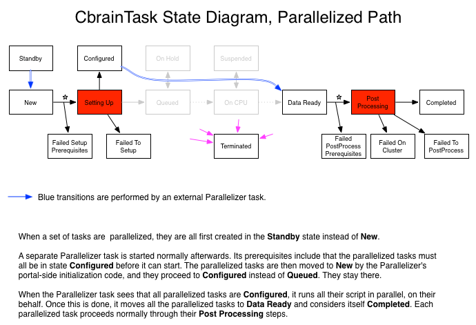

The standard CBRAIN task philosophy is inherently single-processor centric. 
Tasks are traditionally written such that they are submitted to the 
cluster's management system in a single bash script, which runs one copy of 
the scientific tool. 

If the cluster node in question is a multi-cpu computer, and if the cluster
management system never allocates more than one cluster job per node, then we
get into an inefficient situation where only one CPU of the node is actually 
used while the others stay idle. To solve this problem a task programmer can 
explicitly program a CbrainTask such that the bash script calls several copies 
of the scientific task. This is however error prone, as it complicates the 
data synchronization steps, run-time monitoring and error recovery code. 

The CBRAIN task framework has the ability to transparently remedy this situation, 
without having to recode existing tasks.

## Automatic parallelization

Basically, when a task is about to be launched,
the Rails tasks controller will check to see if the following three
conditions are true:

  1. The task's class properties() contain the keyword
     ``:use_parallelizer``; it needs to be set to ``true`` or a number (which
     will be explained later).

  2. An array of task objects is about to be launched (that is, the
     ``final_task_list()`` returned more than one element). This is
     obviously necessary, since we are trying to parallelize them.

  3. The ToolConfig chosen by the user for the task has a suggested
     number of CPUs (ncpus) greater than 1.

If all three conditions are true, then the task launching mechanism will
be altered in the following way:

* The tasks will be created exactly as usual, except their
  starting state will be **Standby** instead of **New**. Tasks in this
  state are ignored by all other system components, including
  Bourreaux and their Workers.

* One (or several) additional Parallelizer tasks will be
  automatically created and launched. Each of these Parallelizer
  tasks will be responsible for a subset of the original tasks
  (henceforth called 'parallelized') that were created in
  **Standby**. The size of the subsets will be the minimum between
  the parallelized task's tool config's ncpus and the numeric
  value given to ``:use_parallelizer`` (if any).  The Parallelizer
  task will then 'turn on' the other parallelized tasks. 'Turning
  on', here, consists in:

  - Setting a special meta attribute on the tasks called
    ``:configure_only``.  This will be used by the Bourreau Workers
    during **Setting Up**, at a later time.

  - Setting their status to **New**, which sends them on the
    standard task state diagram path.

The Parallelizer tasks are configured with a prerequisites: all the
parallelized tasks that they are responsible for must be in a special
state called Configured. Here's how this will happen:

* Each parallelized task, after having been 'turned on' as
  explained above, will be recognized by the Bourreau Workers and
  will proceed through their **Setting Up** process.

* At the very end of being set up, after the bash script is
  written on disk, the tasks will detect that the meta property
  ``:configure_only`` is set. In that case, they will NOT submit
  their bash scripts to the cluster but instead will change
  their status to **Configured**.

Once all parallelized tasks are in state **Configured**, the Parallelizer
tasks will be triggered. Once they are running on the cluster nodes,
they will go into the parallelized tasks' work directories and run
the bash scripts in parallel on behalf of those other tasks.

Once a Parallelizer task's cluster job is finished, it will mark
all its parallelized tasks as Data Ready so that they can proceed
with their normal **Post Processing** steps.

## How to trigger parallelization of existing CbrainTasks

As described above, the new parallelization framework is built on
top of the standard serial design philosophy of the CbrainTasks.
It should work automatically for all standard CbrainTasks (except
for the most esoteric, like those that save their objects in
``final_task_list()``) but for the moment we require task programmers
to enable automatic parallel support by adding the keyword
``:use_parallelizer`` in their PortalTask's class definition.

A programmer aware of the memory or CPU requirements of his scientific
software can provide a maximum number of parallel execution as a
value, or instead just provide ``true`` and let the ToolConfigs
actually specify the number of task instances per Parallelizer.

## CBRAIN administrator configuration

For parallelization to work with existing tasks, the sysadmin must
configure a few more values using the CBRAIN interface.

  1. The tool "Parallelizer" must first be configured using the
     Create Tool button of the Tools panel. The name can be something
     else than Parallelizer, but the class must be exactly
     ``CbrainTask::Parallelizer``. To make the tool invisible to
     users in the task launcher selection box, set the tool's
     Category to "background". The descriptions and launch messages
     must also be filled but will be ignored.

  2. Each of the CbrainTasks that needs to be parallelized also
     needs to have at least one ToolConfig, with a suggested number
     of CPUs greater than one. We recommend indicating clearly in the
     tool config's description that the tool will be run in
     parallel mode.

## State diagram

This diagram is a variation of the standard state diagram
for CbrainTasks, as seen in the [CbrainTask Programmer Guide](CbrainTask-Programmer-Guide.html).
It shows how a task that has been parallelized by an external
paralellizer will proceed through a different set of status
codes. The Parallelizer itself will follow the standard path.

**Note**: Original author of this document is Pierre Rioux