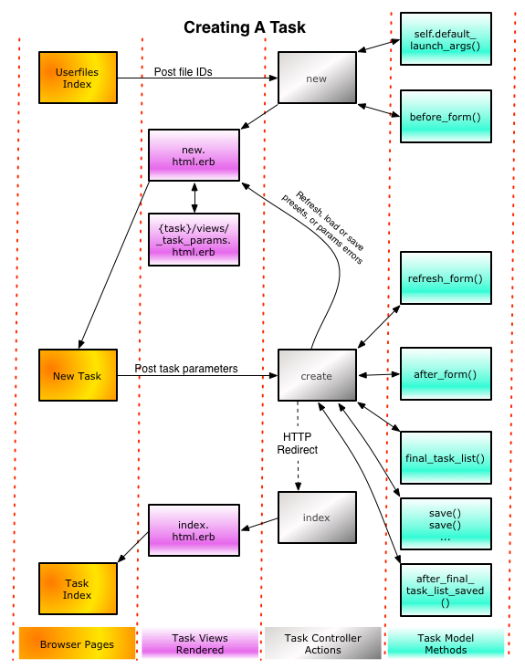
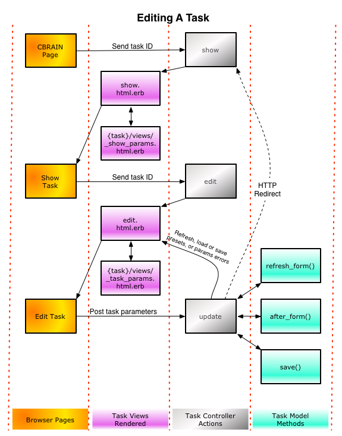
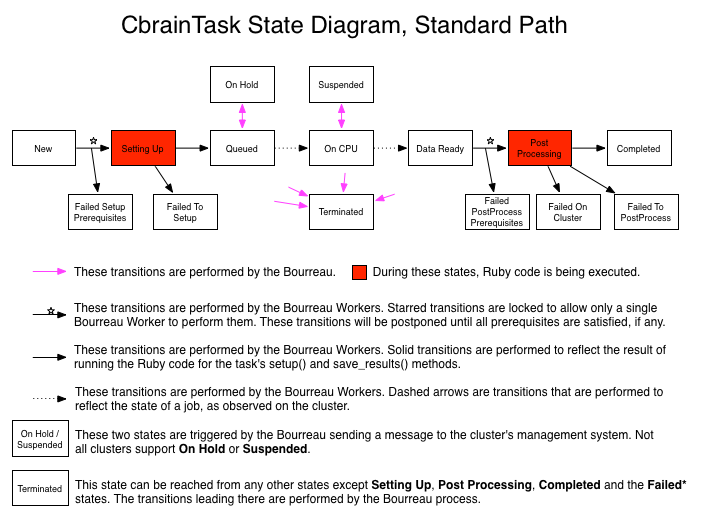

This document describes the CBRAIN task architecture, and how to
code new tasks. Tasks are the data structures that track and control
the transfer of data files to an execution server, and the submission
of a script or program to process them.

## CBRAIN architecture

As explained in the [Setup Guide](../../1-setup/Setup-Guide.html), CBRAIN is organized as two
different Rails applications, one for the web-facing side (BrainPortal)
and one for the execution server-facing side (Bourreau). This
distinction allows us to compartmentalize the CbrainTasks into a
class hierarchy that is different, depending on which side it is
on.

Let us examine one of the CbrainTask that is provided with the
standard CBRAIN distribution.

"Diagnostics" is a task launched by a CBRAIN administrator which
checks different properties of a CBRAIN installation (like whether
or not files get transferred properly, or jobs launched on the
clusters, etc.).

The actual Ruby class of the diagnostics task is "CbrainTask::Diagnostics".
This string ends up in the "type" column of the "cbrain_tasks" table of the
Rails database. CBRAIN uses Rails' "single table inheritance", so whenever one
row of that table is loaded as an object, the type of the object will be
determined by the value of the "type" column.

#### BrainPortal class hierarchy

On the BrainPortal Rails application, all task objects recreated
from the database will inherit from another class "PortalTask",
which inherits from "CbrainTask", which then inherits from "ActiveRecord::Base":

    ActiveRecord::Base < CbrainTask < PortalTask < CbrainTask::Diagnostics

This allows us to store methods at three different levels of the class hierarchy:

* Methods that apply to all tasks are in CbrainTask
* Methods that apply to all tasks on the BrainPortal Rails app are in PortalTask
* Methods that are specific to all CbrainTask::Diagnostics are in there.

In particular, the PortalTask class will contain utility methods
and helpers to provide for the task's life cycle as a web interface
object.

#### Bourreau class hierarchy

A similar situation happens on the Bourreau Rails application. This
time it is another, different class that is between the task and
the CbrainTask class:

    ActiveRecord::Base < CbrainTask < ClusterTask < CbrainTask::Diagnostics

In this case, the ClusterTask class will contain utility methods
and helpers that apply to ongoing situations as the task is
being processed on the Execution Server.

## Code organization

The files that comprise a single CBRAIN task are packaged in a
subdirectory with a specific structure. For the Diagnostics task,
as distributed with the platform, we can see five files spread across a
structure two directories deep:

    diagnostics/portal/diagnostics.rb
    diagnostics/bourreau/diagnostics.rb
    diagnostics/views/_show_params.html.erb
    diagnostics/views/_task_params.html.erb
    diagnostics/views/public/edit_params_help.html

The first four of this list are mandatory. They consist of two Ruby
model files, one for the BrainPortal side and one for the Bourreau
side, and two Rails view partials (under a subdirectory called
views).

#### portal/taskname.rb

The model file under the portal/ subdirectory is where the task
programmer adds the methods necessary to implement the task's web
interface and initialization. Those methods include callbacks that
will be invoked by the CBRAIN framework when the task is created, its
parameter page is rendered or edited, it is officially
saved in the database, and it us ready to be launched.

The class and instance methods that a programmer typically needs to provide are:

    self.default_launch_args()
    self.pretty_params_names()
    before_form()
    refresh_form()
    after_form()
    final_task_list()
    after_final_task_list_saved(task_list)
    untouchable_params_attributes()
    unpresetable_params_attributes()

#### bourreau/taskname.rb

The model file under the bourreau/ subdirectory is where the task
programmer adds the methods necessary to implement the task's
life cycle on the execution server.

The methods that a programmer typically needs to provide are:

    setup()                         # mandatory
    cluster_commands()              # mandatory
    save_results()                  # mandatory
    job_walltime_estimate()
    recover_from_setup_failure()
    recover_from_cluster_failure()
    recover_from_post_processing_failure()
    restart_at_setup()
    restart_at_cluster()
    restart_at_post_processing()

#### View partials

The files views/_task_params.html.erb and views/_show_params.html.erb
(whose names are constant) provide the rendering of the task's
custom elements in the CBRAIN web page. The first is the content
of a form where the user can enter the parameters of a new task.
It will be rendered during the *new* or *update* actions of Rail's
tasks_controller. The second is a status page showing some information
about a task that already exists on the system.

## CbrainTask attributes

Most of the ActiveRecord attributes are rather self-explanatory.
Here are a few that may need some explanation:

* :batch_id

  When several related CbrainTasks are created all at the same, they 
  will all share the same :batch_id; this number is usually the same 
  as the ID of one of the tasks in the batch, often the one with the 
  lowest ID (although this is not guaranteed).

* :cluster_jobid

  The identifier string used on the cluster side to identify the
  job on the clustering system. This attribute can be empty if the
  task's code is run by another task, for instance a parallelizer.

* :cluster_workdir

  The basename of the private work directory where the task's code
  is being run on the cluster side. The ClusterTask class has
  numerous methods to handle reconstructing the full pathname to
  this directory, creating it, archiving it, etc.

* :params

  A serialized hash table containing the private custom parameters
  for this task. The layout and content of this hash is arbitrary
  and is specified by the task's programmer.

* :status

  A set of strings from a controlled vocabulary, tracking the state
  of the task during its lifecycle see `Task life cycle` below).
  The full set of possible values can be obtained from
  constants stored in the Ruby class CbrainTask.

* :bourreau_id and :tool_config_id

  These two IDs point to other ActiveRecords models. :bourreau_id
  is a link to a Bourreau object (in the remote_resources table),
  which represents the execution server associated with this task.
  :tool_config_id is a link to a ToolConfig object, which stores
  information specific to a particular version of the tool that the
  CbrainTask implements.

  One thing to observe is that these two objects encode some redundant
  information: the ToolConfig object also contains its own :bourreau_id
  attribute, which must be in sync. This is an unfortunate feature
  leftover from CBRAIN's history.

* :prerequisites

  A serialized hash table encoding the dependencies that this task
  has on other tasks. For more information see the
  [CbrainTask Prerequisites](CbrainTask-Prerequisites.html) document.

* :share_wd_tid

  The ID of another CbrainTask; this is used when the current task
  is configured NOT to have its own private work directory on the
  cluster, but instead to use the work directory of that other task.

* :run_number

  A number, starting at 1, and increasing every time the task is
  restarted by the user after a successful previous run. It can be
  used by the task programmers to differentiate the outputs of
  slightly different runs of the task, for instance when parameters
  have changed.

* :level and :rank

  These two numbers are optional and are used by the interface (in
  particular by the task index page) to show the list of tasks
  ordered and indented within a batch of tasks.

* :results_data_provider_id

  This attribute is available for a task programmer to know on which
  DataProvider to create the results files, when the task completes
  successfully.

* :workdir_archived and :workdir_archive_userfile_id

  These two attributes are used by the task archiving mechanism to
  track whether or not the task's work directory has been archived,
  and if so, whether the archive was left on the cluster or saved
  back in CBRAIN as a user file.

## Task life cycle

CbrainTasks are standard Rails ActiveRecord objects. On the BrainPortal
side, they are created and edited using an almost standard Rails
action sequence.

#### Task creation

The following diagram shows the interactions between the controller
actions, the views and partial rendered, and the callback methods
implemented by the CbrainTask programmer in the model.

There are a few non-standard paths:

* While the form for a task is being presented to a user, if the
user clicks on a submit button that contains the word 'Refresh',
the form's data will be sent back to the *create* action, which
will invoke the model's refresh_form() method, and then render again
the web form instead of creating the object. Note that the presence
of that 'Refresh' button is optional and is a design choice made
by the task programmer when designing the task's interface.

* The tasks_controller's *create* action can in fact create an
entire array of CbrainTask objects in the database; the form's data
is usually interpreted as a template for such arrays, and the task
programmer is free to supply to the action a single task object,
or an array of objects. This is performed by the final_task_list()
method of the CbrainTask.

* There are numerous special features of the *create* action that
are not shown in this diagram; for instance, once an array of tasks
has been prepared and saved, it is possible for the action to create
special [CbrainTask::Parallelizer](CbrainTask-Parallelization.html)
tasks to regroup them in batches that are going to be run in parallel.

#### Task editing

The following diagram shows what happens when tasks are edited.
Tasks can only be edited while their status are stable (Completed,
Terminated, etc).

Once again, there are a few non-standard features in the paths.

* The 'refresh' button feature is again available, just like when
creating a task.

* The 'status' attribute of a task cannot be edited; instead there
are special controller actions implemented to allow a task to be
restarted, terminated, etc.

#### Standard life cycle diagram

The following diagram shows the standard state diagram of a CbrainTask.
The content of the boxes correspond to the values of the :status
attribute of the CbrainTask object.

Once a CbrainTask object has been saved in the database by the
BrainPortal side, there is almost no other operation that is performed
there. The rest of the life cycle is handled by the Bourreau side,
and most of them by the daemons running there, known as BourreauWorkers.
The workers pick CbrainTasks objects from the databases, one at a
time, and proceed to run their setup code (provided by the task's
programmer), monitor the jobs on the supercomputer side, and save
the results of the tasks (also according to the custom methods added
by the task's programmer).

## Getting started

The simplest way to get started is to follow the steps of the
[New Task Tutorial](New-Task-Tutorial.html). This will demonstrate many features of the CbrainTask
APIs in CBRAIN.

## Advanced features

CbrainTasks are usually designed with a very simple execution model:
they are meant to read some input files, execute a program on them,
and create some output files. Keeping tasks simple allows the
developers to use them in a more complex system, either automatically
or with a little bit of simple programming using these CBRAIN
features:

#### Task restartability and recovery

  Task are not normally restartable once they have completed
  successfully. They are also normally dead and cannot be restarted if they have failed.
  But this is just a conservative default behavior.

  A task's programmer simply has to add a few callback methods to
  tell the CBRAIN framework that the task is indeed restartable or
  can recover from failure.  This includes adding some custom cleanup
  or preparation code. Once done, the user will be able to restart
  successful tasks at three different points in the life cycle, or
  trigger some error recovery code if it has failed.

  Task restartability and recovery is described in a separate
  document, [CbrainTask Recovery And Restart](CbrainTask-Recovery-and-Restart.html).

#### Automatic parallelization

  Several simple tasks can be automatically run in parallel by
  using a separate CBRAIN Parallelizer task. The parallelizer
  will be the only job launched on the cluster, and it will
  run all the other tasks' code. Programmers can code this
  themselves, or make their simple task automatically parallelizable
  so that the system administrator can decide if and when to
  parallelize them when deploying them.

  The mechanism is explained in a separate document,
  [CbrainTask::Parallelizer](CbrainTask-Parallelization.html).

#### Task dependencies

  Tasks can be made to depend on other tasks.

  The task dependency mechanism is explained in a separate document,
  [CbrainTask Prerequisites](CbrainTask-Prerequisites.html).

#### Tasks sharing a work directory

  Each task has, by default, a private work directory created for it.
  But a set of tasks can be made to share a single work directory if
  this is more convenient for a particular processing application.

  The mechanism is described in a separate document,
  [CbrainTask SharedWorkDir](CbrainTask-SharedWorkDir.html).

**Note**: Original author of this document is Pierre Rioux
