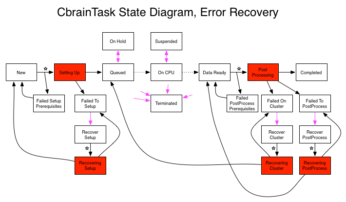

Failures of the scientific tasks on the CBRAIN clusters are a fact
of life. Although unavoidable, we can minimize their impact by
carefully programming recovery code for some common situations. It's
the responsibility of each CbrainTask programmer to figure out what
errors can be recovered and to implement the appropriate recovery
code.

When failures are not a problem, we are left with successfully
completed tasks that could also be restarted. Restarting a task,
however, can often not be performed simply by redoing all the
original operations that were performed during its first execution.
Some files in the work directory are now installed, some cleanup
might be necessary, and some preparation work might no longer be
necessary to repeat.

This document explains how to implement error recovery code when
tasks have failed, and and how to implement restart code when tasks
have completed successfully.

## Error life cycle

There are exactly five status keywords that are used to identify
failure situations in the CbrainTask life cycle. Here is the list,
with a short explanation about what triggers these errors:

| Status                          | Comment                             |
|:--------------------------------|:------------------------------------|
| Failed To Setup                 | `Exception` or `false` in `setup()` |
| Failed On Cluster               | `save_results()` returned `false`   |
| Failed To Post Process          | `Exception` in `save_results()`     |
| Failed Setup Prerequisites      | Other tasks misbehaved              |
| Failed PostProcess Prerequisites| Other tasks misbehaved              |

Two of these can be eliminated right away from the rest of the
discussion: the **Failed * Prerequisites** situations can be recovered
from simply by resetting the state of the task object to an earlier
state, and prerequisites evaluation will be retried the next time
a BourreauWorker wakes up. So for these two error situations, all
tasks already have the ability to recover from the failure (although
it's possible the task will fail its prerequisites check again).

The other three error states correspond to the three main stages
responsible for processing a task. As explained in the
[CbrainTask Programmer Guide](CbrainTask-Programmer-Guide.html), a task will have:

* A pure Ruby stage called **Setting Up**.

  It's implemented by the method `setup()` in the CbrainTask's
  Ruby code. Its purpose is to create subdirectories, files and
  synchronize data files before the real CPU-intensive processing
  occurs on the cluster.

* A bash script run on the cluster during **On CPU**.

  It's provided by the method `cluster_commands()`. The bash
  script is usually a set of calls to the scientific program that
  will perform the task's main computation.

* Another pure Ruby stage called **Post Processing**.

  It's implemented by the method `save_results()` in the CbrainTask's
  Ruby code. Its purpose is first to make sure the bash commands
  finished properly and if so to package and return the resulting
  data files and reports to the CBRAIN environment.

So how are the error states triggered? In the case of the two Ruby
stages, any exception raised by the CbrainTask's code will stop the
task and mark it as **Failed To Setup** or **Failed To Post Process**.
Additionally, if the `setup()` method returns false, the task will
also be marked as **Failed To Setup**.

However, the post processing stage implemented in `save_results()`
will trigger a different error if it returns `false`: it will mark
the task as **Failed On Cluster**. This is the conventional mechanism
used by a developer to detect if the bash script that was run on
the cluster finished successfully. Return `false` if the bash commands
did not perform their job adequately and the task will properly
record that the error really occurred during the cluster's bash
script execution, not during post processing.

## Error recovery

It's left to the user to look at the logs of a failed CbrainTask
to figure out if the error situation is recoverable or not. There
isn't much one can do about errors that are caused by bugs in the
CbrainTask's `setup()` or `save_results()` methods (except maybe
notify the developer).  But other error situations are usually
easily recoverable. For instance, if a file synchronization failed
because the remote DataProvider is offline, we expect we should be
able to turn it back on and try again the task where it failed.

Except for the two errors related to Prerequisites (described above
in section 1), no CbrainTask is recoverable by default. To make a
task recoverable, one needs to enable the capability by providing
a recovery method which must return `true`. There is a specific method
to define for each of the three error states:

| Error State            | CbrainTask's Recovery Method Name        |
|:-----------------------|:-----------------------------------------|
| Failed To Setup        | `recover_from_setup_failure()`           |
| Failed On Cluster      | `recover_from_cluster_failure()`         |
| Failed Post Processing | `recover_from_post_processing_failure()` |

Just like for the `setup()` and `save_results()` methods, the developer
can count on the fact that when these recovery methods are invoked,
the current directory of the process will already have been changed
to the task's work directory.

The methods are expected to return `true` if they think they've
properly fixed the task's environment so that it can restart. While
the method runs, the task's status will be changed to one of these
keywords:

| Original Error State   | State While Executing Recovery Method |
|:-----------------------|:--------------------------------------|
| Failed To Setup        | Recovering Setup                      |
| Failed On Cluster      | Recovering Cluster                    |
| Failed Post Processing | Recovering PostProcess                |

If the method returns `false` or `raise` an exception, the task's status
will return to the original error state and nothing else will happen.
If the method returns `true`, the task's status will be set to one of
the states in the normal processing path:

| Original Error State   | Normal CbrainTask State After Recovery|
|:-----------------------|:--------------------------------------|
| Failed To Setup        | New                                   |
| Failed On Cluster      | Queued (new cluster job launched)     |
| Failed Post Processing | Data Ready                            |

The developer doesn't have to touch the task's status, this tracking
is all performed by the CbrainTask base class.

## Task restart

This section describe a concept strongly related to error recovery.
In the situation where a CbrainTask completed successfully (it went
all the way to state **Completed**), it's possible to imagine that
one would like to redo some parts of the processing. This mechanism
is called 'restarting', and can occur at exactly the same three
stages as error recovery (described in the previous section):

* At setup: Basically, the entire task is restarted. The task's
  work directory is left 'as is', and the `setup()` method is called
  normally. If everything goes well, a new job will be launched
  on the cluster and post processing will eventually take place.

* At cluster: We skip setup and relaunch the task's job on
  the cluster.

* At post processing: we only re-run the post processing
  code in `save_results()`.

Just like in error recovery, a CbrainTask needs to have special
methods implemented in order to enable the three restart capabilities.
The three methods are:

| Restart stage *          | CbrainTask's Restart Method Name  |
|:-------------------------|:----------------------------------|
| At setup                 | `restart_at_setup()`              |
| At cluster               | `restart_at_cluster()`            |
| At post processing       | `restart_at_post_processing()`    |

  \* These are not status keywords

The methods are expected to prepare the task's existing (and
populated) work directory for a restart. This can include erasing
some files, creating new ones, adjusting parameter values, etc.
While the method is running, the task's state will be set
to one of these keywords:

| Restart Method Name            | State While Executing Restart Method |
|:-------------------------------|:-------------------------------------|
| `restart_at_setup()`           | Restarting Setup                     |
| `restart_at_cluster()`         | Restarting Cluster                   |
| `restart_at_post_processing()` | Restarting PostProcess               |

Just like in error recovery, the methods must return `true` for the
restart capability to be enabled. Returning `false` will cancel the
restart and the task's status will stay in **Completed**. If
a restart method is successful, the task's state will return
to one of three values:

| Restart stage *    | CbrainTask's State After Restart  |
|:-------------------|:----------------------------------|
| At setup           | New                               |
| At cluster         | Queued (new cluster job launched) |
| At post processing | Data Ready                        |

  \* These are not status keywords

Unlike error recovery, the CBRAIN system's task management will
provide a way for tracking separately the task's standard output,
standard error and anything else that the developer wants to track
separately for each restart session. This is accomplished by having
a new attribute called `:run_number` in the task. This is originally
initialized at '1' and is used to build the filenames of the files
that captures the outputs and errors for the task. The `:run_number`
attribute is not affected by error recovery or task failures, but
it is increased by one after each successful invocation of the
`restart_*()` methods listed above.

A developer can use the `:run_number` to build filenames for work
files or Userfiles too. Some other useful methods build strings
that can be used for tracking the run number, see the documentation
for the method `run_id()` for instance.

## Writing Code That Is Naturally Restartable

Both the error recovery capabilities and the restart capabilities
can be made simpler for the average CbrainTask programmer by following
a few simple rules while writing the Ruby code in `setup()` and
`save_results()`. The most obvious cases are encountered when trying
to configure a resource that already exists; for instance, the
`setup()` method could want to create a work subdirectory named
**my_output** and the developer would normally write this:

```ruby
Dir.mkdir("my_output")   # OK, but not restartable
```

If the job is restarted or if we are attempting error recovery,
this statement will raise an exception because the subdirectory
already exists. A better way to proceed is to make a simple check:

```ruby
Dir.mkdir("my_output") unless File.directory?("my_output")
```

As another example, consider the case where in the `save_results()`
method a programmer creates a new userfile to store results:

```ruby
res = SingleFile.create!( # works only once!
           :name             => "results-#{self.run_id}",
           :data_provider_id => dpid,
           :user_id          => user.id,
           :group_id         => user.own_group.id
         )
res.cache_copy_from_local_file("my_output/report.txt")
```

Imagine that the data provider is offline; then the database entry
for the SingleFile 'res' will be properly created but the
`cache_copy_from_local_file()` will crash. This code is not recoverable
because on a second pass through it, it will attempt to recreate
the SingleFile, raising a new exception in method `create!()` (because
only one file can have the same name on the same data provider, per
user). A way to make the code recover is to delete the SingleFile
in the recovery method:

```ruby
def recover_from_post_processing_failure
  bad_res = SingleFile.find(:first, :conditions =>
                          { :name => "results-#{self.run_id}" } )
  bad_res.destroy if bad_res
  true
end
```

A much better way to write the `save_result()` code is to make the
result file creation code fully restartable (and recoverable):

```ruby
res_att = {
  :name             => "results-#{self.run_id}",
  :data_provider_id => dpid,
  :user_id          => user.id,
  :group_id         => user.own_group.id
 }
res = SingleFile.find(:first, :conditions => res_att) ||
      SingleFile.create!(res_att) # works multiple times!
res.cache_copy_from_local_file("my_output/report.txt")
```

This way, you can attempt to execute the same piece of code several
times and the SingleFile creation code will either create the file
or fetch the previously created one. The big advantage of writing
code that is naturally restartable is that the `recover_*()` and
`restart_*()` methods become naturally trivial too: you can make them
simply return `true`:

```ruby
def recover_from_post_processing_failure
  true # so simple now!
end
```

In order to simply writing CbrainTask code that is restartable, a few
utility instance methods have been added to the CbrainTask class:

```ruby
  safe_mkdir("relative_path_to_some_work_subdir",mode)
  safe_symlink("path_to_something","rel_path_to_new_symlink")
  safe_userfile_find_or_new(klass, attlist)
```

See the documentation in the class `CbrainTask` for more information.

## BrainPortal interface / Bourreau controller

The BrainPortal interface has been enhanced to provide a way to
restart tasks, or attempt error recovery. Basically, the interface
does NOT know which tasks are restartable or recoverable, it just
sends the request to the Bourreau side. If the restart or recovery
capabilities are programmed for a task, they will be triggered,
otherwise the tasks are left alone. The task's log will track the
attempts made for restarting or recovery.

The interface also provides a way to trigger recovery for tasks
with failed prerequisites, or to duplicate an existing task completely
(this means restarting it anew with a new work directory, so this
is not a 'restart' like described above).

On the Bourreau side, the requests are received and the tasks
affected will get a new status. Again, the Bourreau does not know
which task is restartable or recoverable, it only validates that
the task's CURRENT state is compatible with the restart or recover
request. Here are the five status keywords that the Bourreau
intercepts and validates, and the status that gets saved to the
tasks to trigger the error recovery or restart code:

| Bourreau Receives<br>This Keyword | Allowed Task<br>Current Status | Task Action<br>Status |
|:--------------------|:-----------------------|:----------------------|
| Recover             | Failed * Prerequisites | "New" or "Data Ready" |
| Recover             | Failed To Setup        | Recover Setup         |
| Recover             | Failed On Cluster      | Recover Cluster       |
| Recover             | Failed To Post Process | Recover PostProcess   |
| Restart Setup       | Completed              | Restart Setup         |
| Restart Cluster     | Completed              | Restart Cluster       |
| Restart PostProcess | Completed              | Restart PostProcess   |

The 'Action Status' are recognized by the Bourreau Workers, which
then trigger the recovery or restart methods and track whether or
not they are successful. As explained in the previous section, these
statuses will be changed to ones with '-ing' in their names, such
as **Recovering Setup**, while the methods are running.


## State diagrams

[](../images/CbrainTaskStates.png)

---

[](../images/CbrainTaskStates_Recover.png)

---

[](../images/CbrainTaskStates_Restart.png)

**Note**: Original author of this document is Pierre Rioux
