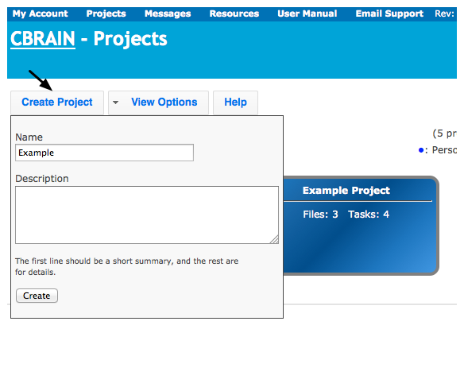
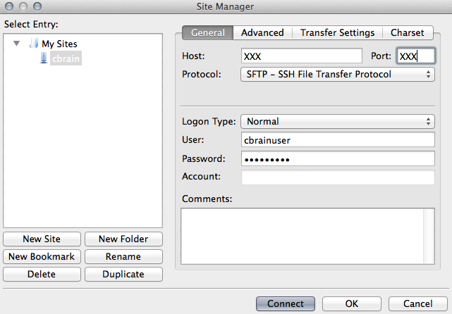
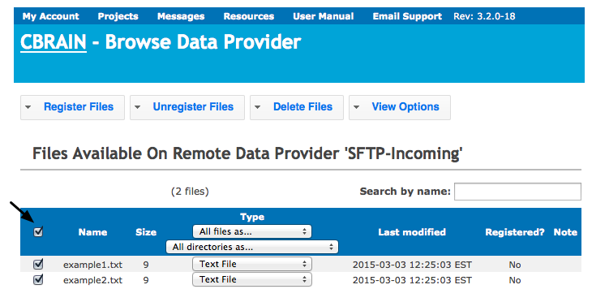
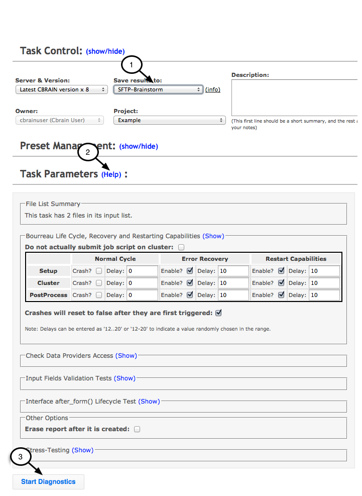
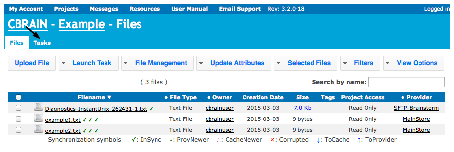

This manual provides an introduction to CBRAIN, a web-based platform for storing files and running tasks on them.
CBRAIN has been developed by support from [CANARIE](http://www.canarie.ca), in professor [Alan Evans'](http://mcin-cnim.ca/people/alans-cv/) lab at [the McConnell Brain Imaging Centre](http://www.mcgill.ca/bic/research-0/ace-lab-evans) and the McGill Centre for Integrative Neuroscience ([MCIN](http://mcin-cnim.ca)), at [McGill University](http://www.mcgill.ca/).
CBRAIN is easy to use and no computer programming expertise is required. All you need is a web browser  (recent versions of Firefox, Safari or Chrome, Internet Explorer) and you don’t need to install any specialized software.

## Getting started

#### Getting an account
See your service administrator.

#### Typical data workflow in CBRAIN
* Upload your files to CBRAIN
* Run a task (e.g. "Diagnostics") on your files on CBRAIN
* Examine your processed output files on CBRAIN
* Download your output files to your computer

#### Two Methods for Uploading/Downloading Files in CBRAIN
* If you just have a few files, you can transfer the files one by one using the web browser.
* If you have many files, you can might find it more convenient to upload them all at once using a SFTP server.

**Note**: The typical workflow steps in CBRAIN are different depending on which of these two methods you choose, as explained below.

This guide explains how to carry out the steps of typical data workflow in the order listed above using either method for transferring files and using "Diagnostics" as an example of a task which can be carried out in CBRAIN.

## Create a project

* Login in to CBRAIN

When you log on you are sent to a project summary page.  A project is a storage space unit for your files and tasks.  You can either open an existing project by clicking on it or create a new one.
* Click on "Create Project"

  * After the new project has been created, a list of all projects are shown in "Button View".
  * Projects are color coded according to whether each project is Personal (blue), Shared (green) or System (red).
  * In this case, the "Example" we created is Personal (blue).

## Upload files

**Data Providers - Network Storage Space**: The files in CBRAIN are stored in a "Data Provider", which is network storage space for files on a computer. This could be on your own computer or on another computer you connect to using CBRAIN.

**Two Options for Uploading Files**: If you only have a few files to upload, you may find it convenient to upload them one by one, or if you have many files, to upload them all at once.

#### Upload files one by one using Web Browser

* Click on project you created where you want files to go

* Click on "Upload File"

* Select files to upload
* You have the option of uploading zipped (archived) files and extracting them
* There is a memory limit of 400 MB per file - if you exceed this, use SFTP server

* Repeat upload procedure for each file
* Continue until all files have been uploaded to project

#### Upload files all at once using  SFTP server

###### Method 1: Filezilla or another GUI SFTP Client

If you are using Mac, Windows or Linux/Unix Operating systems, we recommend that you use Filezilla or another graphical user interface SFTP Client to transfer files.

* **Instructions for Filezilla:**
  * Download and install Filezilla on your computer
  * Select "File" menu, then click on "Site Manager"
  * Select "New Site"
  * Under "General Tab" in "Site Manager"
    * Enter hostname: See your service administrator
    * Enter port number: See your service administrator
    * Select Server Type: SFTP - SSH File Transfer protocol
    * Select Logon Type: NORMAL
    * Enter the username and password for your CBRAIN account

  * Under "Advanced" tab in "Site Manager"
    * Select "Bypass proxy"

    * Click connect
  * Files on your local computer are listed on the left
  * Files on the remote computer are listed on the right
    * Files may be dragged to move them to and from the remote and local computers

###### Method 2: Command line

It is very convenient to use a graphical user interface SFTP Client as described above.  However, you also have the option of performing these operations at the command line:
* cd < name of directory where files will go >
* sftp -o port=XXX cbrainuser@xxx.xx (See your service administrator)
* put *.txt
* Options can be displayed by entering help into the command line

#### Common part: Move Files from Temporary Storage SFTP Server to Data Provider
* Move Files from Temporary Storage SFTP Server to Data Provider

  * Click on "Browse" to the right of your "Data Provider"

  * You should see a list of files you already uploaded
  * Check boxes for all files
  * If the file format is not automatically detected correctly (e.g. "TextFile"), fix this by selecting the file format with the drop down menu under "Type" (click on "All files as…").

* Move your files from the temporary server to "MainStore":
  * Click on "Register Files" tab
  * Choose project where the files will go (e.g. "Example")
  * Select "Move the files to Data Provider"
  * Choose Data Provider where the files will go (e.g. "MainStore")
  * Click "Register the files"

  * Note that if you register a large number of files, this can take some time

## Start a task

* Select the project you created
* Click on "Files" tab
* If you don’t want to run a task on all of the files, one method to avoid having to click on each file individually is to search files by name (1), or create a custom filter.
**Note**: that the filter will remain in effect until you clear it, so you may think that files are missing if you forget that it is there. If you want to remove the filter, click on "Clear" link next to "Active Filters".
* Select all the files you want to run a task on (2)

* Steps to Start Task:
  * Click on "Launch Task"
  * Click on drop down menu list to select a task
  * Choose task version and server
**Note**: Once you choose a server, you will get a message with approximate time that it might take to start running. You may choose to switch to a different server if the time estimate is too long.

  * Enter task parameters for "Diagnostics"
  * You can select the Data Provider on which the result will be saved (1) in the "Task Control" section
  * You can choose some parameters for your task in the "Task Parameters" section. You can click on "Help" (2) link in "Task Parameters" section of window, and there are "Help" links like this whenever you launch a task.
  * Click "Start Diagnostics" (3)

  * New task appears

## Check the progress of a task

* Check back later to see if task completed

* **Troubleshooting Tip - Check the Log Information**: As a task is running log information is generated. If there are red error messages and the task did not complete, check the log information to see what happened.
  * Steps for Accessing the Log Information:
    * Click on "Projects" menu, and then the name of project

    * Click the "Tasks" tab

    * Click on "Diagnostics" (name of task) to show log information

    * Scroll down to see log information - the following is an example of part of the log (not all lines are shown).

* **Another Troubleshooting Tip - Trigger Error Recovery**: Usually if a task doesn’t complete, the issue is related to problems with the input files, but occasionally the task may stop because of a server error. If this occurs, one option you have is to restart the task using "Trigger Error Recovery". If this does not resolve the issue, the problem is likely with the input files.
  * Steps for Trigger Error Recovery:
    * Click on "Projects" menu, then name of project.
    * Click on "Tasks" tab, then check box to select failed task.
    * Click on "For Failed Tasks", then "Trigger Error Recovery"

## Viewing the output of a finished task

* Click on "Diagnostics" (name of task)

* Go to the section "Parameters"
* Click on the link after "Report"

* Click on "Show Displayable Content"

## Downloading processed output files from finished task

Follow the same procedure you used for uploading files but in reverse. You may find it convenient to download files one by one if you just have a few files, or if you have many files, to download them all at once.

#### Download files one by one using Web Browser

* Click on "Projects" menu, then click on name of project
* Click on "Files" and check box next to file you want to download

* Click on "File Management" (1)
* Enter the name for downloaded file (2)
* Click on "Download Files" (3) - file will download to Downloads folder on your computer

#### Download files all at once using SFTP Server

* Check boxes for all output files to download (1)
* Or you may find it easy to use the "Filter" feature to select just the output files to download
* **Note**: that you have to click on "Clear" next to "Active Filters" if you want to clear the filter. If you forget this you might come back later and think that files are missing.
* Click on "File Management" (2)
* Select a SFTP data provider in this case "SFTP-Brainstorm" from drop down menu (3)
* Click "Copy Files" (4)

###### Method 1: Filezilla or other GUI interface SFTP client

* Open Filezilla (or other) application
* Use same SFTP settings as before (section (#3.2)), but transfer files in the opposite direction
Drag/drop files from SFTP-Brainstorm to your computer

###### Method 2:  Command line SFTP

Use commands to change to the right directory and download files:
* cd < directory_name_to_download_files >
* sftp -o port=XXX cbrainuser@xxx.xx (See your service administrator)
* get -r *

**Note**: depending on your system, you may get an error message if you try to download files that haven’t been archived using get -r *. If this is the case,  go to "File Management", and click on
"(Un)Archive" to archive files. This is a toggle switch, meaning that if a file is unarchived it will archive it, and vice versa. Once archived, copy it to the SFTP server. Then do the following:
* cd < directory_name_to_download_files >
* sftp -o port=XXX cbrainuser@xxx.xx (See your service administrator)
* get */*.tar.gz

###### Common part: Delete your data from the temporary storage SFTP Server

* Click on "Resources" and drop down menu to "Data Providers"

* Click on "Browse" to right of your Data Provider (e.g. SFTP-Brainstorm)

* Check boxes for all files that you want to delete and click "Delete Files"

## Optional advanced feature of CBRAIN

**Data Provider Configured on User’s Computer**": This manual describes two different options for uploading/downloading files, either using the web browser or SFTP Server. There is in fact a third option for advanced users, which is to use a Data Provider on your own computer, which makes it easier to transfer files. If you wish to use this option, see your service administrator

## Help and technical support

**Methods for Getting Help**:
* There are "Help" buttons at many places on the on-line system.
* For descriptions of different tools and their parameters, go to "Resources" menu and click on "Tools".
* There is a "Help" screen for a particular task, whenever you launch a new task.
* If you have any questions about using CBRAIN or comments on this guide, you can email support:
cbrain-support.mni at mcgill.ca.

## Citation
If you use CBRAIN to process data, please cite the following publication:
[Sherif T, Rioux P, Rousseau M-E, Kassis N, Beck N, Adalat R, Das S, Glatard T and Evans AC (2014) CBRAIN: a web-based, distributed computing platform for collaborative neuroimaging research. Front. Neuroinform. 8:54. doi: 10.3389/fninf.2014.00054](http://journal.frontiersin.org/article/10.3389/fninf.2014.00054/abstract)

**Note**: original author of this user guide is Athena Buckthought
